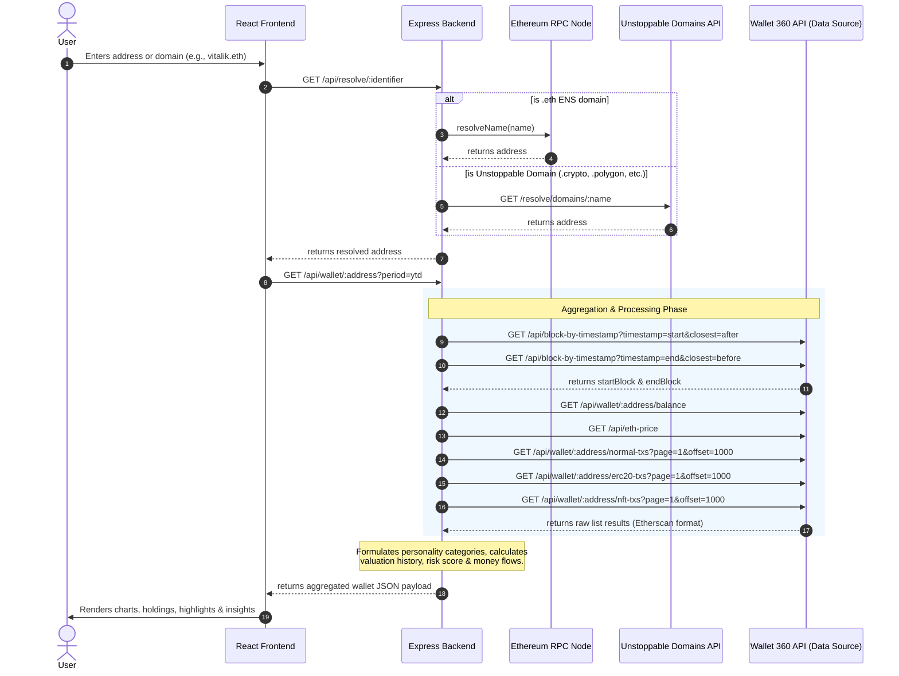

# MyWallet360 Codebase Audit & System Architecture Report

This report presents a thorough audit of the **MyWallet360** codebase, outlining its overall architecture, frontend/backend implementations, security, caching strategy, and offering a concrete integration guide for the **Wallet 360 API** (hosted at `http://134.209.107.4:8080/`).

---

## 1. Project Overhaul Objectives (June 18, 2026)

Below are the official overhaul objectives, problems, solutions, and core requirements defined for the MyWallet360 product refresh:

> **Source**: Pooja Ranjan — 18/06/2026, 23:59
> **Subject**: MyWallet360 Overhaul

*   **Problem**: The legacy dashboard was unusable because it only displayed the native ETH balance, failed to account for total wallet worth, and relied on unreliable public Etherscan APIs.
*   **Solution**: Rebuild the dashboard with a primary focus on user utility and data integrity.
*   **Data Source**: Replace Etherscan with in-house APIs from **BlobLens** (configured as `BLOCKACTION_API_URL` / Wallet 360 API).
*   **Rationale**: Ensures data consistency and enables future promotion of the BlobLens/Wallet360 APIs.

### Core Feature Requirements
*   **Total Value**: Display total wallet worth aggregated across ETH and all ERC-20 tokens.
*   **Asset Breakdown**: Show a table of all known tokens with their corresponding USD value.
*   **Transaction Tagging**: Allow users to add private notes (e.g., "salary", "donation") to transactions for tax reporting.
*   **Historical Charts**: Provide interactive charts of wallet value over time.

### UI/UX Directives
*   **Native vs. Fiat Toggle**: Add a toggle to view values in USD or native tokens (ETH/ERC-20s).
*   **Aesthetics & Space Efficiency**: Improve font sizes and layout space-efficiency.
*   **Design References**: Use EIPS Insight and BlobLens dashboards as key visual and functional references.

---

## 2. Executive Summary

**MyWallet360** is a modern, responsive web application that aggregates Ethereum wallet portfolio and transaction data to present visual dashboard insights. It determines net worth over time, profiles user behavior (e.g., DeFi explorer, token trader), and exports reports to Excel format.

### Key Technology Stack
*   **Frontend**: React 19 (using modern hooks and standard styling), Vite 6 (build system), Tailwind CSS v4, and Recharts (for charts).
*   **Backend**: Node.js, Express 5.x, Axios (API requests), Ethers v6 (provider & ENS resolution), and ExcelJS (Excel document creation).
*   **APIs & Data**: Resolves ENS names using an EVM RPC node and Unstoppable Domains via Unstoppable API. Retrieves block timestamps, token transfers, and balances via an Etherscan-compatible proxy API (configured as `BLOCKACTION_API_URL`).

---

## 3. System Architecture

The following diagram illustrates the interaction between the frontend app, backend services, and external APIs during a typical search and analysis request.



---

## 4. Frontend Analysis

The frontend code resides in the root directory and the `src` folder. It is structured around clean React design patterns.

### Key Directories
*   `src/components/dashboard/`: Contains core dashboard cards, including [BalanceCard.jsx](file:///Users/dhanushlnaik/Workspace/Dev/Avarch/mywallet360/src/components/dashboard/BalanceCard.jsx) (historical asset line charts), [PortfolioHoldings.jsx](file:///Users/dhanushlnaik/Workspace/Dev/Avarch/mywallet360/src/components/dashboard/PortfolioHoldings.jsx) (token distribution pie chart and token balance lists), `Activity.jsx`, and `WalletPersonality.jsx`.
*   `src/components/layout/`: Common layouts such as the header (search query controls, Web3 connect button) and navigation components.
*   `src/services/`: [walletService.js](file:///Users/dhanushlnaik/Workspace/Dev/Avarch/mywallet360/src/services/walletService.js) handles API fetch orchestrations and processes backend JSON structures.
*   `src/hooks/`: Contains custom hooks like `useWalletDashboard` (handles search logic, state updates, and EIP-6963 injection protocols for browser wallets) and `useTheme` (app dark/light mode toggle).

### Code Quality & Design Observations
1.  **Rich Visual Presentation**: The application relies on `src/styles.css` (approx. 113KB) implementing a premium glassmorphic visual appearance with custom hover gradients, dark/light themes, and responsive grid layouts.
2.  **Web3 Provider Integration**: Handles multi-wallet discovery using standard EIP-6963 (`eip6963:announceProvider` and `eip6963:requestProvider` listeners), enabling robust connections to MetaMask, Coinbase Wallet, etc.
3.  **Clean Separation of Concerns**: React views rely heavily on data adapters within `walletService.js` and `useWalletDashboard.js` rather than mixing raw API fetching with render cycles.

---

## 5. Backend Analysis

The backend (located in `/backend`) exposes a lightweight REST API wrapper that proxies blockchain endpoints and parses outputs into user profiles.

### Core Services
*   [domain-resolution.service.js](file:///Users/dhanushlnaik/Workspace/Dev/Avarch/mywallet360/backend/src/services/domain-resolution.service.js): Uses a standard JSON-RPC provider mainnet fallback configuration for resolving ENS names and routes Unstoppable Domains via their public REST API.
*   [personality.service.js](file:///Users/dhanushlnaik/Workspace/Dev/Avarch/mywallet360/backend/src/services/personality.service.js): Assigns personality scores to an address. Categorizations are weighted by swap counts, NFT transfers, DeFi interaction volumes, and asset balances.
*   [protocol-resolution.service.js](file:///Users/dhanushlnaik/Workspace/Dev/Avarch/mywallet360/backend/src/services/protocol-resolution.service.js): Translates raw contract interaction addresses into human-readable labels (Uniswap, Aave, Compound, OpenSea, 1inch).
*   [reportmaker.js](file:///Users/dhanushlnaik/Workspace/Dev/Avarch/mywallet360/backend/src/services/reportmaker.js): Generates professionally-styled, landscape-oriented Excel sheets (`.xlsx`) using ExcelJS, including credit/debit color codes and metadata.
*   [blockaction.service.js](file:///Users/dhanushlnaik/Workspace/Dev/Avarch/mywallet360/backend/src/services/blockaction.service.js): Coordinates blockchain API queries, performs calculations, structures the data, and strips out large internal structures (raw transaction loops) before returning data to the browser client via `buildPublicWalletData`.

### Security, Rate Limiting & Resilience
*   **Security Headers**: Implemented in `security.middleware.js` to strip header components and prevent vulnerability scanner exploits.
*   **CORS Checks**: Dynamically parses allowed origins (`FRONTEND_URL` environment variable) in production, denying unauthorized domains.
*   **Rate Limiting**: Exposes `walletAnalysisRateLimit` (default 10 requests per minute per IP) and `domainResolutionRateLimit` (default 30 per minute per IP).
*   **Caching Strategy**: Implements two layers:
    1.  *Raw Request Cache* (`responseCache` Map): Caches external blockaction/Etherscan queries for 5 minutes (`CACHE_TTL_MS`).
    2.  *Wallet Analytics Cache* (`walletCache` Map): Caches fully structured dashboard results by address and period (5-minute TTL).
    > [!IMPORTANT]
    > Because caching uses raw in-memory maps, deploying to serverless environments (like Vercel Serverless Functions) will reset cache states on new function cold-starts. For production stability under heavy traffic, using a Redis cache layer is recommended.

---

## 6. Wallet 360 API Integration Guide

The newly created **Wallet 360 API** hosted at `http://134.209.107.4:8080/` offers a RESTful, clean alternative to standard Etherscan query parameters. Below is the mapping of how the existing query patterns translate to these new REST endpoints.

### Endpoint Mapping

| Purpose | Existing BlockAction Query | New Wallet 360 API Path | Auth Required |
| :--- | :--- | :--- | :--- |
| **ETH Balance** | `?module=account&action=balance&address=addr` | `GET /api/wallet/:address/balance` | `X-API-Key` or `Bearer` |
| **Normal Transactions** | `?module=account&action=txlist&address=addr...` | `GET /api/wallet/:address/normal-txs` | `X-API-Key` or `Bearer` |
| **ERC-20 Token Transfers** | `?module=account&action=tokentx&address=addr...` | `GET /api/wallet/:address/erc20-txs` | `X-API-Key` or `Bearer` |
| **NFT (ERC-721) Transfers** | `?module=account&action=tokennfttx&address=...` | `GET /api/wallet/:address/nft-txs` | `X-API-Key` or `Bearer` |
| **ETH Spot Price** | `?module=stats&action=ethprice` | `GET /api/eth-price` | None |
| **Block by Timestamp** | `?module=block&action=getblocknobytime...` | `GET /api/block-by-timestamp` | None |
| **Admin Key Provisioning**| *None* | `POST /api/wallet/admin/new-key` | `Admin secret` |

> [!WARNING]
> **Internal Transactions (`txlistinternal`):**
> The current backend uses `txlistinternal` (Etherscan standard) inside `blockaction.service.js` to calculate complete money flows. The user's Wallet 360 API endpoints list **does not show an endpoint** for internal transactions.
>
> **Actionable Recommendations**:
> 1. Extend the Wallet 360 API to support `GET /api/wallet/:address/internal-txs` in the future.
> 2. Until then, modify the backend service to either fallback gracefully (return an empty list for internal txs) or call Etherscan directly as a fallback.

---

## 7. Code Migration Plan

To adapt MyWallet360's backend to query the live Wallet 360 API, updates must be made to [blockaction.service.js](file:///Users/dhanushlnaik/Workspace/Dev/Avarch/mywallet360/backend/src/services/blockaction.service.js).

### Configuration Updates
Update `backend/.env` with your credentials:
```bash
BLOCKACTION_API_URL=http://134.209.107.4:8080
BLOCKACTION_API_KEY=w360_your_issued_api_key
```

### Code Implementation Changes
The helper function `blockActionRequest` can be updated, along with `fetchPaginated` and `getAnalysisPeriod` / `getWalletData` calls, to query REST endpoints instead of appending query variables. 

Below is the diff showing how to refactor [blockaction.service.js](file:///Users/dhanushlnaik/Workspace/Dev/Avarch/mywallet360/backend/src/services/blockaction.service.js) to support the RESTful endpoints and include authorization headers:

```diff
 export async function blockActionRequest(params) {
   if (!BLOCKACTION_URL) {
     throw new Error("BLOCKACTION_API_URL is not configured");
   }
 
-  const requestParams = {
-    chainid: CHAIN_ID,
-    ...params,
-  };
-  if (process.env.BLOCKACTION_API_KEY) {
-    requestParams.apikey = process.env.BLOCKACTION_API_KEY;
-  }
-  const cacheKey = new URLSearchParams(requestParams).toString();
+  // Build endpoint URL and headers depending on Etherscan params
+  let targetUrl = BLOCKACTION_URL;
+  let headers = { Accept: "application/json" };
+  let queryParams = {};
+
+  if (params.module === "account" && params.action === "balance") {
+    targetUrl = `${BLOCKACTION_URL}/api/wallet/${params.address}/balance`;
+    headers["X-API-Key"] = process.env.BLOCKACTION_API_KEY;
+  } else if (params.module === "account" && params.action === "txlist") {
+    targetUrl = `${BLOCKACTION_URL}/api/wallet/${params.address}/normal-txs`;
+    headers["X-API-Key"] = process.env.BLOCKACTION_API_KEY;
+    queryParams = {
+      page: params.page,
+      offset: params.offset,
+      sort: params.sort,
+      startblock: params.startblock,
+      endblock: params.endblock,
+    };
+  } else if (params.module === "account" && params.action === "tokentx") {
+    targetUrl = `${BLOCKACTION_URL}/api/wallet/${params.address}/erc20-txs`;
+    headers["X-API-Key"] = process.env.BLOCKACTION_API_KEY;
+    queryParams = {
+      page: params.page,
+      offset: params.offset,
+      sort: params.sort,
+      startblock: params.startblock,
+      endblock: params.endblock,
+    };
+  } else if (params.module === "account" && params.action === "tokennfttx") {
+    targetUrl = `${BLOCKACTION_URL}/api/wallet/${params.address}/nft-txs`;
+    headers["X-API-Key"] = process.env.BLOCKACTION_API_KEY;
+    queryParams = {
+      page: params.page,
+      offset: params.offset,
+      sort: params.sort,
+      startblock: params.startblock,
+      endblock: params.endblock,
+    };
+  } else if (params.module === "stats" && params.action === "ethprice") {
+    targetUrl = `${BLOCKACTION_URL}/api/eth-price`;
+  } else if (params.module === "block" && params.action === "getblocknobytime") {
+    targetUrl = `${BLOCKACTION_URL}/api/block-by-timestamp`;
+    queryParams = {
+      timestamp: params.timestamp,
+      closest: params.closest,
+    };
+  } else if (params.module === "account" && params.action === "txlistinternal") {
+    // Fallback: internal-txs are currently not exposed on the live API.
+    // We can fall back to an empty list or Etherscan public node if desired.
+    return [];
+  }
+
+  const cacheKey = targetUrl + "?" + new URLSearchParams(queryParams).toString();
   const cached = getCached(cacheKey);
   if (cached) return cached;
 
   return scheduleRequest(async () => {
     let lastError;
 
     for (let attempt = 0; attempt < 3; attempt += 1) {
       try {
-        const response = await axios.get(BLOCKACTION_URL, {
-          params: requestParams,
+        const response = await axios.get(targetUrl, {
+          params: queryParams,
+          headers,
           timeout: 15_000,
         });
 
         if (response.data?.status === "0") {
           const errorMessage = `${response.data.message} ${response.data.result}`.toLowerCase();
 
           if (errorMessage.includes("no transactions")) {
             return setCached(cacheKey, []);
           }
 
           if (errorMessage.includes("rate limit") && attempt < 2) {
             await wait(750 * (attempt + 1));
             continue;
           }
 
           throw new Error(response.data.result || response.data.message || "BlockAction request failed");
         }
 
         return setCached(cacheKey, response.data?.result ?? response.data?.data ?? response.data);
```

---

## 8. Audit Recommendations & Improvements

1.  **Implement Redis Caching**: The API rate limits on both sides (frontend-to-backend rate limit and blockchain data source rate limit) make robust caching critical. Replace in-memory `Map` instances in `blockaction.service.js` with Redis to persist caches across serverless instances and reduce data-source overhead.
2.  **Add Internal Transaction Support to Wallet 360 API**: Since token swaps and complex interactions (especially related to DeFi platforms) routinely trigger transactions that transfer ETH via smart contracts (internal transactions), omitting internal transfers from the dashboard results in slightly inaccurate net worth histories and missing details in money flow.
3.  **Address E2E and Unit Test Coverage**: Build checks currently fail due to missing dependencies. Once installed, expand coverage on `blockaction.service.test.js` to validate how the adapter behaves when hitting the Wallet 360 API compared to standard Etherscan models.
